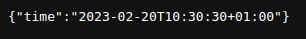

## SEC-Lab-1
### First Lab on Software Engineering Components
---
**In this project we have developed an HTTP server, which returns a json response with current time.**

### Contributors:
- Danil Yaremenko danilyaremenko@gmail.com
- Nikita Petrykin n.petrykin.im12@kpi.ua
- Yurii Grygorash gyv220427@gmail.com
- Yan Petrov yanemerald2004@gmail.com

### How to use:
1. Open terminal & clone repo to your pc:
```bash
git clone https://github.com/nikitosikvn1/SEC-Lab-1.git
```
2. Go to your local repo directory:
```bash
cd SEC-Lab-1/
```
3. Run local server:
```bash
go run main.go
```
4. Follow this link http://127.0.0.1:8795/time:


